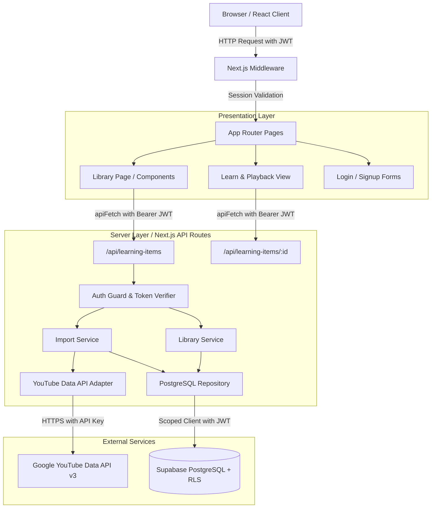

# LearnUp — Complete System Overview & Documentation

**Version:** 0.1.0 (MVP)  
**Stack:** Next.js 14 (App Router), TypeScript, React, CSS Modules, Supabase (PostgreSQL + Auth + RLS), YouTube Data API v3  
**Status:** MVP Features Implemented & Tested (94/94 Automated Tests Passing)

---

## 1. Product Mission & Purpose

LearnUp is a private, distraction-free YouTube learning library designed to help users curate and study YouTube educational content without the distraction algorithms, comments, recommendations, or autoplay loops of YouTube.

---

## 2. Implemented Features & User Capabilities

### 🔐 Authentication & Session Management
- **User Registration (`/signup`)**: Email & password signup with client-side & server-side validation.
- **User Login (`/login`)**: Email & password authentication generating secure JWT session tokens via Supabase Auth.
- **Session Protection**: Middleware and App Layout enforce deny-by-default access. Unauthenticated requests to `/library` or `/learn` redirect to `/login`. Authenticated users visiting `/login` or `/signup` are redirected to `/library`.
- **Password Visibility Toggle**: Interactive show/hide toggle on password fields with accessible SVG icons.
- **Sign Out**: Clean session termination and state reset.

---

### 📚 Learning Library Management (`/library`)
- **Owned Library Grid/List**: Displays all learning items belonging strictly to the authenticated user.
- **Item Cards (`LearningItemCard`)**:
  - Displays thumbnail, title, video count (for playlists), and created date.
  - Distinguishes between direct **Single Videos** and **Playlists**.
  - Provides quick action to open learning view (`/learn/[id]`) or delete the item.
- **Interactive States**:
  - **Loading State**: Skeleton loader placeholder cards during data fetch.
  - **Empty State**: Informative onboarding graphic with a direct "Add Learning Item" button.
  - **Error State**: User-friendly error message with a "Try Again" retry trigger.
- **Item Deletion & Confirmation Modal (`DeleteModal`)**:
  - Deleting an item removes the LearnUp record and its child videos safely without altering anything on YouTube.
  - Confirmation dialog prevents accidental deletions.

---

### 📥 YouTube Content Import (`ImportModal`)
- **Universal YouTube URL Parser**:
  - Direct video URLs (`youtube.com/watch?v=...`, `youtu.be/...`, `youtube.com/embed/...`, `youtube.com/shorts/...`).
  - Playlist URLs (`youtube.com/playlist?list=...`).
  - Video URLs with embedded playlist context (`watch?v=...&list=...`).
- **YouTube Data API v3 Integration**:
  - Fetches video snippet, status, and highest-resolution available thumbnail.
  - Automatically iterates through paginated playlist items (`maxResults=50` with `nextPageToken`).
  - Filters out deleted videos, private videos, and inaccessible items.
  - Preserves deterministic `source_position` ordering for all playlist videos.
- **Import Idempotency**:
  - Prevents duplicate imports of the same video or playlist for the same user.
  - If a user imports an existing item, the system safely returns the existing item without creating database duplicates.

---

### 🎬 Focused Learning & Playback View (`/learn/[id]`)
- **Clean Embedded YouTube Player**:
  - Uses the official YouTube iframe embed (`youtube.com/embed/VIDEO_ID`).
  - Zero third-party tracking, distraction feeds, or video proxying.
- **Playlist Navigation Sidebar**:
  - Displays the ordered list of child videos in the playlist.
  - Highlights currently active/selected video.
  - Allows seamless switching between videos in the playlist.

---

## 3. Architecture & Tech Stack

---

## 4. API Endpoints & Contracts

All `/api/learning-items` endpoints require an `Authorization: Bearer <token>` header.

| Method | Endpoint | Description | Status Codes |
|---|---|---|---|
| `GET` | `/api/learning-items` | Lists all learning items for current user | `200`, `401`, `500` |
| `POST` | `/api/learning-items` | Imports YouTube video/playlist by URL | `201` (New), `200` (Duplicate), `400`, `401`, `404`, `422`, `502`, `503` |
| `GET` | `/api/learning-items/:id` | Gets single item with child videos (if playlist) | `200`, `400`, `401`, `404`, `500` |
| `DELETE` | `/api/learning-items/:id` | Deletes learning item and cascade child videos | `204`, `400`, `401`, `404`, `500` |

---

## 5. Database Schema & Row-Level Security (RLS)

### PostgreSQL Tables

#### `learning_items`
- `id` (UUID, Primary Key)
- `user_id` (UUID, References `auth.users.id`, NOT NULL)
- `source_type` (`video` | `playlist`, ENUM)
- `source_id` (TEXT, YouTube Video ID or Playlist ID)
- `title` (TEXT, NOT NULL)
- `thumbnail_url` (TEXT)
- `created_at` / `updated_at` (TIMESTAMPTZ)
- **Constraint:** `UNIQUE (user_id, source_type, source_id)` enforces per-user idempotency.

#### `playlist_items`
- `id` (UUID, Primary Key)
- `learning_item_id` (UUID, References `learning_items.id` ON DELETE CASCADE)
- `video_id` (TEXT, YouTube Video ID)
- `title` (TEXT, NOT NULL)
- `thumbnail_url` (TEXT)
- `source_position` (INTEGER, Zero-based index)
- `is_accessible` (BOOLEAN, default true)
- `created_at` (TIMESTAMPTZ)
- **Constraint:** `UNIQUE (learning_item_id, source_position)` prevents duplicate ordering slots.

### Security Invariants
- **Row Level Security (RLS)** is enabled on all tables.
- Scoped database clients use the authenticated user's JWT so PostgreSQL evaluates `auth.uid() = user_id`.
- Cross-user queries and mutations strictly return `404` or `403`.

---

## 6. Design System & Frontend Tokens

The design matches the Figma Design System specifications (`globals.css`):
- **Colors:**
  - Primary Indigo: `#4F46E5` / `#4338CA`
  - Slate Backgrounds: `#0F172A`, `#1E293B`, `#334155`, `#F8FAFC`
  - Text: Primary `#0F172A`, Secondary `#475569`, Muted `#94A3B8`
  - Error: `#EF4444`, Success: `#10B981`, Warning: `#F59E0B`
- **Typography:** Inter, System-UI stack with scale (`text-xs` through `text-3xl`).
- **Components:** Modular CSS Modules (`Button`, `Input`, `Alert`, `Card`, `Modal`, `Header`, `SkeletonLoader`).
- **Theming:** CSS Variables setup ready for future dark mode extension.

---

## 7. Automated Test Suite

- **94/94 passing tests** across unit, integration, and security suites:
  - `tests/unit/parser.test.ts`: URL parser patterns and normalization.
  - `tests/unit/youtube-client.test.ts`: YouTube API adapter and pagination.
  - `tests/unit/import-service.test.ts`: Video & playlist import transactions.
  - `tests/unit/library-service.test.ts`: Library listing and deletion.
  - `tests/integration/api-qa.test.ts`: Full API contracts, error mapping, and edge cases.
  - `tests/integration/api.test.ts`: End-to-end endpoint lifecycle.
  - `tests/integration/auth-hook.test.ts`: Session tokens and RLS cross-user security checks.
